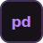

  

 

## `rapha@github:~$` whoami

**Raphaely Mendes**

| | |
|:--|:--|
| 🏢 **empresa** | PicPay — Assistente de Desenvolvimento, DevSecOps / Red Team |
| 🎓 **estudos** | Desenvolvimento de Sistemas & Análise de Dados |
| 🔐 **foco** | Red Team · AppSec · automação ofensiva |

Atuo no time de DevSecOps do PicPay, na frente de Red Team dentro da área de Cibersegurança — encontrando as brechas antes que alguém mal-intencionado as encontre. Fora das simulações de ataque, estudo Desenvolvimento de Sistemas e Análise de Dados, unindo instinto ofensivo a fundamentos sólidos de engenharia. Entre um exploit e uma query, sigo construindo: código, conhecimento e novas formas de pensar como quem ataca — para defender melhor.

 

# Languages and Technologies

**`/languages`**
 

**`/frameworks-e-bibliotecas`**
 

**`/dados`**
 

**`/ferramentas`**
 

**`/security`**
 

 

## `rapha@github:~$` git log --stat

 

**Raphaely Mendes**

`rapha@github:~$ exit_`

